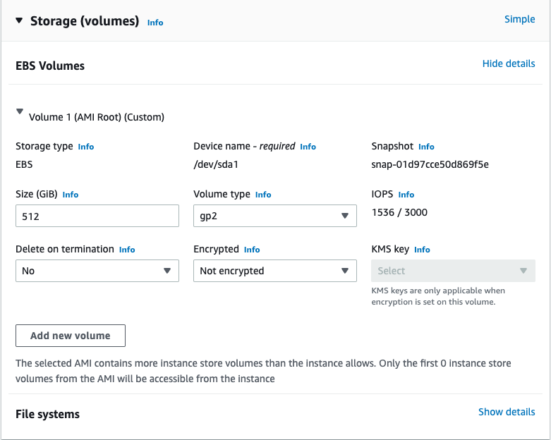
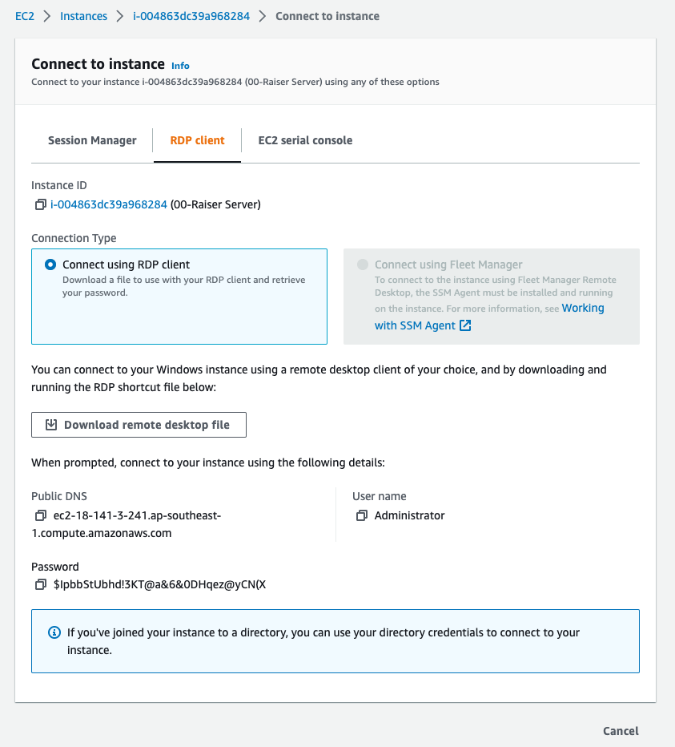
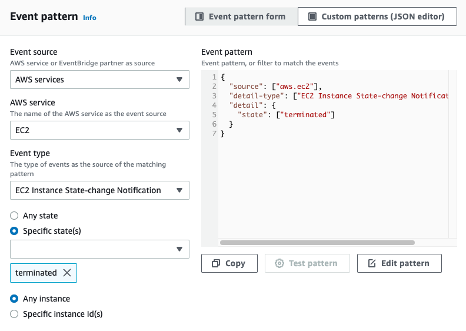

# Setup instructions

This article describes how this project was setup from scratch.

# Core Concepts

This project uses the following:

-   AWS EC2
-   AWS Lambda Functions
-   AWS EventBridge
-   AWS Snapshots
-   AWS EBS Volumes
-   AWS AMI & Launch Templates

# System Description

The 00R Server Client runs on a single EC2 instance. To minimize cost, the system has been designed to start and stop using text commands sent to a discord bot. Thereafter, the bot programmatically starts/stops and backs up everything. The following concepts have been utilized to minimise cost:

1. Backups are stored as AMI images and EBS snapshots instead of EBS volumes.
2. Automatically terminate instance when idle.

**On Startup**  
The system uses a Launch Template to startup future instances of the server. This instance will use the previous instance as an AMI (see SnapAndDelete script).

**On Shutdown**  
When the EC2 instance has been terminated, the EBS Volume will remain so that we can back it up as a snapshot. An AWS Lambda Function has been configured to execute this on instance termination.

# Setup Instructions

Please ensure that you are in the right region before executing the following steps.

## **Setup Security Groups**  
We will need to setup an RDP Security Group for our EC2 instance. 
1. Navigate to **EC2 > Security Group**.
2. Select **Create security Group**
3. Under **Inbound rules**, select **Add rule** and add a rule of type RDP with Source as Anywhere-IPv4.
   


## **Create a new EC2 Instance**

On the first setup, we will need to configure the instance for which successive instances will be based on.
Launch a new EC2 instance with the following configurations:

- Name: "00-Raiser Server"
- AMI : "Windows_Server-2022"
- Instance Type: "g4dn.xlarge" or "t2.medium"
- Key Pair: \<create a new pair>
- Network Settings: "RDP Access"
- Storage: "512 gp2, Delete on termination - No, Encrypted - No"



## **RDP into new instance**  
Once the instance state is "Running", RDP into the server by doing the following:

1. Check EC2 instance >  **Connect** > RDP Client
2. Select Get Password and provide your private key.
3. Your public DNS and password should now be visible, use those to remote into the EC2 instance.



## **Setup Windows**

See Windows Setup.

## **Configure Backup Lambda**  
1. Navigate to Lambda > Create function
2. Select a Python 3.9 Runtime
3. Copy the SnapAndDelete.py code to the lambda function. Make sure to set the GAMING_INSTANCE_NAME, GAMING_INSTANCE_REGION and GAMING_INSTANCE_SIZE_GB appropriately.
4. Test and Deploy the lambda. The lambda should delete the EBS Volume, create a new snapshot and AMI from the previous instance. You should see a lambda output similar to the following:

```
START RequestId: 4e2ece9c-3b3f-4b2f-8c0b-7eea3ad5a824 Version: $LATEST
Created snapshot: snap-08bc41c0df0dae964
Deleting EBS volume: vol-037f2c2d0a0aba6d1, Size: 512 GiB
Created image ami-0b55e3c0d99eb0bdf
END RequestId: 4e2ece9c-3b3f-4b2f-8c0b-7eea3ad5a824
REPORT RequestId: 4e2ece9c-3b3f-4b2f-8c0b-7eea3ad5a824	Duration: 212933.36 ms	Billed Duration: 212934 ms	Memory Size: 128 MB	Max Memory Used: 83 MB
```

## **Configure EventBridge**

To invoke the lambda created, create a new rule to run whenever the EC2 instance is terminated.

1. Navigate to EventBridge > Rules
2. Select Create a rule 
3. Under Event Pattern, set the AWS Service to EC2, Event type to EC2 Instance State-change Notification and specific state to terminated.
4. Under Targets, search for Lambda function and select the function created previously.



## **Configure Launch Template**

Create a launch template with the same configurations as step 1.

1. Navigate to EC2 > Launch Templates
2. Fill in the following:
   - Key Pair: (same as initial setup)
   - Storage: (same as initial setup)
   - Resource tags: 
     - Name: 
       - Value: (server name in initial setup)
       - Resource Types: Instance, Volumes
     - SnapAndDelete:
       - Value: True
       - Resource Types: Instance, Volumes
     - Advanced setup
       - Termination Protection
         - Disable
       - Detailed CloudWatch Monitoring
         - Disable
3. Once the launch template is complete, copy the template id and update the .env files.

## **Setup Discord Bot**

# FAQ

# References

-   https://www.rockpapershotgun.com/v-rising-server
-   https://www.youtube.com/watch?v=gE20QLY6gAI
